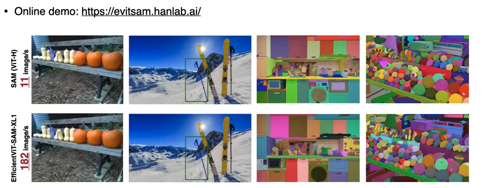

# Lecture 1: Introduction

Slides: https://www.dropbox.com/scl/fi/h3ggav4eopxsitqxzf6t2/Lec01-Introduction.pdf?rlkey=hzbpsha72p5e3ed4mdvcgcda5&e=1&st=pz5u977e&dl=0
Video: https://www.youtube.com/watch?v=U7EPZv8Kh9w&feature=youtu.be

Model size grows every year at a much faster rate than GPU memory:

Studies on model compressions is becoming more and more popular:

### Use cases:

## 1. Vision

### On device inference:

### On device training:

- Training is much more expensive than inference, because we would need to store the activations, calculate the gradients, perform backpropagation, etc.

- Using quantization and other model compression techniques, training on limited hardware such as microcontrollers is possible.

Segment Anything optimization:

Image generation models optimization:

Other use cases: 3D image generation, video generation, self driving with 3D perception, sensor fustion, etc

## 2. Language

Use cases: Coding, translation, etc

- Lite transformers is able to reduce the transformer model from 176MB to 9.7MB, making it much easier to deploy on a phone.

- There are different methods to inference an LLM based on the tasks, it is a tradeoff between accuracy and first token latency.

- Every percent of accuracy improvements comes at a much larger cost.

- Chain of thought prompting includes a thought process in the few shot example in the prompt, forcing LLMs to think before answering complex questions, making it more accurate for reasoning problems.

- Again, model size needs to be big to show meaningful improvements with COT

Sparse attention prunes "less useful" tokens (e.g. "I", "the", "a"), improving efficiency while maintaining accuracy.

- Deploying LLM on the edge also improves latency, removing network latency.

- Smoothed quant. levels makes quantization easier, will learn in this course. C/C++ prerequisites is important, manipulating pointers, SIMD, cache, locality, multithreading, multi core processors, register, parallelism.

## Multimodal

Combining modalities such as Images, Languages, Audios, Videos, Actions, etc.

Example:

- Image above shows that AWQ quantization gives better accuracy than naive methods.

- Visual transformers tokenizes not only texts, but also images! It will then project them into the same vector space for generation.

Example prompt:

Visual in-context learning, similar to few-shot prompting:

Text to Action modality:

AlphaGo and AlphaFold:

# Three pillars of Deep Learning:

Quantization and pruning brings significant improvements:

- New trends: Parallel computing, specialized hardware, low precision compute

Software innovation is important:

- This course utilize existing hardware, make software more efficient on existing hardware, implications for designing new hardware.

Cloud AI Hardware:

- TOPs/compute is growing fast.
- Memory bandwiwdth is more expensive, energy is dominated by moving data.
- Unfortunately power is also growing fast, an 8 GPU node will take 4 to 5 thousand Watts, energy and cooling will be the bottleneck. Now two cables can only serve 4 nodes of A100 and 2 nodes of H100, previously it can serve an entire rack.
- Memory growing slower than compute.

Edge AI Hardware:

- Performance improving fast as well. However the graph shows peak performance, which doesn't indicate speed accurately, speed can be affected by activations, data movement, utilization, etc.
- Power remains relatively flat.
- Memory has steady improvements.

Mobile GPU, used in EVs:

Microcontrollers, used in IoT devices such as cameras:

Big Gap

- We can close the gap between Cloud AI and Edge AI by using model compression techniques.

Current ML vs Tiny ML

