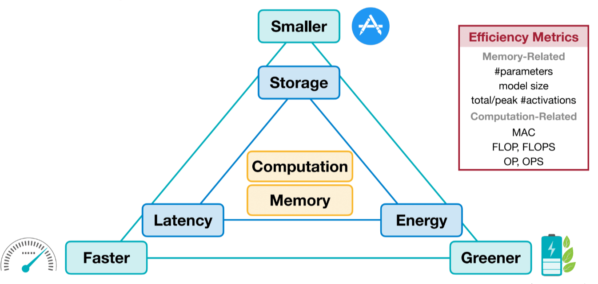

# Lecture 2: Basics of Neural Networks

Slides: https://www.dropbox.com/scl/fi/pxvvqyq2yu6mwgk79bq5x/Lec02-Basics.pdf?rlkey=tsumfkhrglic55jnjs4yu66ni&st=cmwnvuvn&dl=0
Video: https://www.youtube.com/watch?v=27AFYvoE9kQ&list=PL80kAHvQbh-qGtNc54A6KW4i4bkTPjiRF&index=4

Lecture plan:
1. Neural network terminology
2. Popular building blocks of neural networks - Convolution, Pooling, Transformers, Normalization, etc.
3. Popular efficiency metrics - #Parameters, Model size, Peak #Activations, MAC, FLOP, FLOPS, OP, OPS, Latency, Throughput
4. Lab 0 - PyTorch

## Neuron and Synapse

- Synapses = Weights / Parameters
- Neurons = Features / Activations
- y = f(Sum(wi*xi)+b) -> f is the activation function, i is the number of inputs, b is the bias, w is the weights

Question: A wide neural network means it has a higher dimension in the hidden layers. Whereas a deep neural network refers to one that has more hidden layers. We can represent the same number of parameters with a wide but shallow neural network and a narrow but deep one. Which type of neural network is more efficient on Deep Learning hardware?

Answer
A wide and shallow one will be more efficient because layers can be computed parallely but a deep neural network will require more kernel calls. However, from the accuracy perspective, a deep and narrow one may be more accurate. Efficiency is about tradeoff.

## Popular Neural Network Layers

### Fully Connected Layer (Linear Layer)
In a Linear layer, the output neuron is connected to all input neurons. Normally used for prediction.

Tensor shapes:
- Input Feaures X: (1, ci) -> ci, input channels
- Output Features Y: (i, co) -> co, output channels
- Weights W: (co, ci)
- Bias b: (co, )
- In terms of efficiency, understanding the dimension of the neural network is SUPER important.

### Fully Connected Layer (Linear Layer) with multiple inputs
If there are multiple inputs given at the same time, the row of Input and Output features will be n which represents the input batch size.

Tensor shapes:
- Input Feaures X: (n, ci) -> n, input batch size.
- Output Features Y: (n, co) -> n, input batch size.
- Weights W: (co, ci)
- Bias b: (co, )

### Convolution Layer 1D Conv
Output neuron is ONLY connected to input neurons in the receptive field. Used for capturing local spatial features such as edges and corners.

Tensor shapes:
- Input Feaures X: (n, ci, wi) -> wi -> Input width
- Output Features Y: (n, co, wo) -> wo -> Output width
- Weights W: (co, ci, kw) -> Kernel Width
- Bias b: (co, )
  
### Convolution Layer 2D Conv
Most CNN are 2D as it represents images. In this case we have both height and width. Output can be interpreted as the distinct features captured. The deeper the convolution, the more complete the feature. For example, Conv layer 1 might capture edges, Conv layer 5 may capture eyes, nose, etc.

Tensor shapes:
- Input Feaures X: (n, ci, hi, wi) -> wi -> Input width, hi -> Input height
- Output Features Y: (n, co, h0, wo) -> wo -> Output width, ho -> Output height
- Weights W: (co, ci, kh, kw) -> Kernel Width and Height
- Bias b: (co, )

The number size of the output feature can be calculated as such based on the input feature size and kernel size which determines the number of shifts:

Question: If my input has hi = 4, kernel is kh = 2, what is the size of ho?

Answer
Kernel can shift three times in the h dimension, hence ho is 3. Inline with the equation h0 = hi-kh+1, 3 = 4-2+1

### Padding
Because of the equation h0 = hi-kh+1, a deeper CNN will result in smaller and smaller feature maps. To solve this, we can pad the output feature map to make it the same size as the input feature map.

Common padding strategies:
- Zero Padding: Pad all sides with 0 
- Other Paddings: Reflection padding, Replcation padding, Constant Padding

Zero padding is the most popular.

### Receptive Field
A receptive field refers to the region of the input image that affects a particular activation in a neural network layer. As the network goes deeper, the receptive field becomes larger because each layer aggregates information from increasingly broader regions of the input. This expanded receptive field allows the network to capture spatial relationships between different objects—such as cars, pedestrians, and traffic lights—which is crucial for high-level understanding and decision-making in tasks like autonomous driving (e.g., when to accelerate or brake).

### Strided Convolution Layer
To address the problem of shallow neural networks not being able to capture large receptive fields, we can downsample the image using strided convolution layer. Instead of shifting by one pixel, strided convolution layer can shift 2 or more pixels, expanding the size of receptive fields on deeper layers. Hence capturing more relationship of the local pixels in the original image.

This technique allows us to reduce the number of layers while maintaining the size of the receptive field, but it trades off accuracy as the model capacity might be smaller. The beauty of neural network design is optimizing the constraints of model accuracy and efficiency!

### Grouped Convolution Layer
Regular Convolution Layer has all the output channels connected to the input channels, we can optimize this by dividing the channels into groups. The number of weights will be g times smaller

Tensor shapes:
- Input Feaures X: (n, ci, hi, wi) -> Same as regular CNN
- Output Features Y: (n, co, h0, wo) -> Same as regular CNN
- Weights W: g . (co/g, ci/g, kh, kw) -> g number of (co/g, ci/g, kh, kw) weights where g refers to Groups
- Bias b: (co, )

Question: If a CNN layer has co = 2, ci = 4, kh = 2, kw = 2, what is the number of parameters with Group = 2 and without Grouping.

Answer
Regular = 2x4x2x2 = 32 ; Grouped = 2 (2/2 * 4/2 * 2 * 2) = 16 

Note: co and ci must be divisible by Group.

### Depthwise Convolution Layer
The most extreme case for Grouping is when g = co = ci, where every output feature only maps to one input feature. LOL.

Tensor shapes:
- Input Feaures X: (n, ci, hi, wi) -> Same as regular CNN
- Output Features Y: (n, co, h0, wo) -> Same as regular CNN
- Weights W: (c, kh, kw) -> co = ci
- Bias b: (co, )

Very widely used in 2015, 2016 when MobileNet was invented.

### Pooling Layer
Basic method to downsample an image across layers. Since there is no weights for this layer, it is quite effiient.

### Normalization Layer
Normalization stabalizes and speed up training optimization. There are different samples of pixels/information we can use for normalizations such as Batch, Layer, Instance or Group.

Layer Norm is widely used in Transformers. Normalize at each Attention layer to prevent any tokens from overpowering others. Normalization can also be fused with layers such as Smooth Quantization, preventing multiple kernel calls, more details in later chapters.

### Activation Function
Activation functions allow learning non-linear representations.

- Sigmoid - Ancient, ranges between 0 and 1, so its easy to quantize, problem is gradient vanishes at extremes (super small or large).
- ReLU - Popular, negative gradients die, easy to sparsify, useful in pruning, sparse matmul eliminates 0 values from compute. Simple and efficient
- ReLU6 - ReLU has dynamic range, it can be infinitely large, ReLU6 clips the value to 6, making the quantizaion range constrained, mkaing it easier.
- Leaky ReLU - Allow negative gradients, disadvantage is sparsity benefits will be gone.
- Swish - Similar to ReLU. Harder to implement in hardware
- Hard Swish - Easier to implement in hardware than Swish.

All activation functions invented has something to do with efficiency - eg. Sparsity, quantization, dynamic ranges, ease of implementation, etc.

### Transformers

## Efficiency Metrics
Covers the key efficiency metrics important to make models run more efficient.

- Storage - Model size cannot be too large for edge devices.
- Energy - Running neural networks on the edge should not drain the battery life too quick.
- Latency - Ensure the model runs fast enough for better user experience.
- Computation and memory will determine the storage, latency and energy.
- Memory metrics - #Parameters, model size, total/peak #activations.
- Computation metrics - MAC, FLOP, FLOPS, OP, OPS

### Latency
Measures the delay for a specific task.

### Throughput
Measures the rate at which data is processed.

### Latency vs Throughput
- Latency - how long does it take to finish one task?
- Throughput - how many tasks can be finished in one second?

Answer:
1. No, high throughput means more images can be processed in one second, however to get the first image processed will take 100ms whereas if we process sequentially we might get the first image processed in 50 ms althought it will take longer for multiple images.
2. No, low latency means we can get the first output quite fast, but to finish processing a batch of input might take longer as we are processing sequentially.

Question: In what scenario would we prefer higher throughput and which scenario would we prefer lower latency?

Answer
In Mobile phones we might want lower latency for better user experience to satisfy user's short attention span and craving for immediate feedback. In data centers and servers where we run batch jobs, we might want better throughput as it will be faster with higher number of inputs.

### Latency
Equations to get a rough estimation of latency:

### Energy consumption of different operations

- Accessing DRAM memory is very expensive compared to normal arithmetics
- Computation is cheap, memory/data movement is expensive.
- Some models like transformers with KV Cache is bottlenecked by memory bandwidth.

#### Memory Metric 1: #Parameters
Table for number of parameters based on CNN architectures, bias is ignored:

Challenge: Calculate the number of parameters in AlexNet based on the table:

1. #Params Conv 1 = 96 x 3 x 11 x 11 = 24847
2. #Params Conv 2 = (256 x 96 x 5 x 5)/2 = 307200
3. #Params Conv 3 = 384 x 256 x 3 x 3 = 884736
4. #Params Conv 3 = (384 x 384 x 3 x 3)/2 = 663,552
5. #Params Conv 3 = (256 x 384 x 3 x 3)/2 = 442,368
6. #Params Linear 1 = 4096 x (256 x 6 x 6) # Flattened = 37,748,736
7. #Params Linear 2 = 4096 x 4096 = 16,777,216
8. #Params Linear 3 = 1000 x 4096 = 4,096,000

Answer is 61M parameters in total

#### Memory Metric 2: Model Size
Model size is directly proportional to #Parameters. In general, Model Size = #Parameters * Bit Width

#### Memory Metric 3: #Activations
- #Activation is the memory bottleneck in CNN inference, not #Parameters.
- For example in MobileNet, the number of parameters is lower, but the peak activation is higher.

- Third layer of MobileNet is the max memory required

- If our Microcontroller Unit only as 256kB SRAM, it will be slow.
- #Activation is also the bottleneck for CNN Training.

- Optimzing #Activation is hard.

- From Layer 1 (Left) to Layer n (Right)
- Number of Activations in AlexNet (higher resolution in early layers means more activations):

#### Compute Metric 1: MAC
MAC = Multiply-Accumulate Operations
- Multiply=Accumulate Operation (MAC)
  - a = a + b * c # Typical matrix multiplication SUM(row A * column B), so in this case we multiply each element and accumulate into a. One accumulation and one multiplication, in GPUs this is a single instruction
- Matrix-Vector Multiplication (MV)
  
  - MACs = m * n
- General Matrix-Matrix Multiplication (GEMM)
  
  - MACs = m * n * k
  

#### Compute Metric 2: FLOP
FLOP = Floating-Point Operations (FLOP)
- A multiply is a floating point operation
- An add is a floating point operationn
- One multiply-accumulate operation is TWO FLOP
  - Example: AlexNet has 724M MACs, total number of FLOP will be 1.4G FLOPs
- Floating Point Operation Per SEcond (FLOPS)
  - FLOPS = FLOPs / second
  
#### Compute Metric 3: OP
- Activations and Weights are not always in floating point.
- To generalize, number of operations is used to measure the computation amount.
  - AlexNet has 724M MACs, so 1.4G OPs
- Operation Per Second (OPS)
  - OPS = OPs / second

