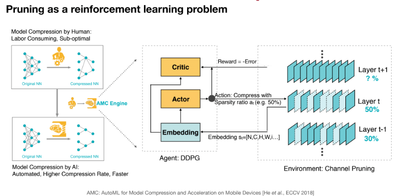

# Part 1: Efficient Inference - Pruning and Sparsity Part 2

- Pruning Ratio
- Finetuning after pruning
- Hardware and systems support for pruning

## Pruning Ratio

How should we find per layer pruning ratio?

Recap: Non-uniform pruning (ratio based on layers) is better than uniform shrinking (same ratio for all layers).

### Approach 1. Analyze the sensitivity of each layer

Additional Notes:

- Here we are assuming all layers act independently of each other. The above graph shows the result of pruning just one layer each time, however the layers interact with each other, for example pruning layer 1 by 50% and then performing the same experiment above for layer 2 will yield a different result. This tradeoffs experimentation effort (GPU hours) with accuracy.
- Each layer may have different number of parameters so a high pruning ratio for certain layers may not be significant in terms of compression. For LLMs, almost all layers will have the same number of parameters.
- Is this optimal? Maybe not, because we do not consider the interaction between layers. Can we go beyond heuristics? Yes!

### Approach 2. Automatic Pruning with AMC

- It takes a lot of effort to perform pruning if doing it manually, the more layers a model has, the higher the effort. Example, ResNet with 50 layers may take weeks to prune.

- Can we automate it? Yes, by formulating pruning as a Reinforcement Learning problem. AMC: AutoML for Model Compression.

- The reward function makes sure the Agent produces a model with low Error and Flop. The reason reward uses log(FLOP) is because of empirical evidence that the accuracy and number of Ops has a logarithmic relationship.

- We can also optimize latency constraints with a pre-built loopup table.

RL Setup:

- State: 11 features (including layer indices, channel numbers, kernel sizes, FLOPS, ...)

- Action: A continuous number (pruning ratio) between 0 and 1.

- Agent: DDPG for continuous output

- Reward: R = -Error if satisfies contrains, else infinity.

- Results:

Additional Notes:

- Interestingly, the RL agent found that 3x3 convolutions have more redundancy and 1x1 having less. Pruning 3x3 layer will have more significant compression, which heuristic approach will take into account.

- AMC shows better speedup than naively setting 0.75 ratio for MobileNet.

Question: After 0.75 channel pruning ratio, why is the speedup 1.7x instead of 1.25x?

Answer
Because the # FLop calculation for Convolution layer has 6 terms, ci, co, h, w, kh, kw. Pruning away channel input and channel output, ci and co will produce quadratic speedup.

### Approach 3. NetAdapt

- A rule-based interative/progressive method

- The goal of NetAdapt is to find a per-layer pruning ratio to meet a global resource constraint (e.g., latency, energy, ...)

- It is done iteratively.

- Using latency as an example:

The Algorithm:

Results:

## Finetuning

How should we improve the performance of sparse models?

- After pruning, the model will have decrease on accuracy. Especially for larger pruning ratio.

- Finetuning is used to recover the accuracy and push the pruning ratio higher.

### Iterative Pruning

- Consider pruning followed by a finetuning is one iteration.

- Iteration pruning gradually increases the target sparsity in each iteration and finetune the weights. From 30% to 50% to 70%:

Key takeaways:

- Learning rate for fine-tuning is usually 1/100 or 1/10 of the orginal learning rate. This is because the model pretty much has converged compared to when training from scratch.

- Iterative pruning and finetuning is difficult to automate. It will require more engineering effort. But it will boost pruning ratio from 5x to 9x on AlexNet compared to single-step aggressive pruning.

### Regularization

## System Support for Sparsity

- Efficient Inference Engine (EIE): Weight Sparsity + Activation Sparsity
- NVIDIA Tensor Core: M:N Weight Sparsity
- TorchSparse & PointAcc: Activation Sparsity

### EIE

The First DNN Accelerator for Sparse, Compressed Model

Notes:

- Sparse Weight Memory footprint is 5x instead of 10x is because an index is needed to represent the locations of the non zero weights. Usually 2 bit.
- Activation is dynamic, different inputs will result in difference activation values. Therefore we cannot remember the activations, so no memory footprint benefits.
- These techniques are not new but is still widely used in modern day, even in LLM.
- Pruning and Quantization hurts the accuracy, can we do both? Yes, we want to do pruning before quantization, more in next chapters.

Parallelization on Sparsity

- PE: Processing Elements
- Input Activations: 1x4 vector
- Weights: 8x4 Matrix
- Ouput Activations: 8x1 vector
- PE0 (Green), PE1(Purple), PE2(Blue), PE3(Orange) runs in parallel

How they are represented physically (PE0):

Overhead to represent sparsity:

- Virtual Weight: Checks column 1, then 2, 3, 4 and stores non zero elements.
- Relative index: Determines the number of elements skipped (zero) after the previus element. For example, W4,2 has relative index 2 because 2 zero elements were skipped from W0,1 to W4,2, distance = 2.
- Column Pointer: Which element is starting a new column. log2(n)

4 Multiply Accumulates Activations:

Input Activation 1 (Skipped):

Input Activation 2 (Not skipped) multiplied by different PE in parallel:

Input Activation 3 (Skipped):

Input Activation 4 (Not skipped):

#### Micro Architecture for each PE

1. Activation values passed into Act Queue, zero activations skipped.
2. Pointer Read: to get the locations of the sparse matrix.
3. Sparse Matrix Access: Use the pointers to access the sparse matrix elements.
4. Weight Decoder: Decode weights from 4bit to 16bit
5. Arithmetic Unit: Perform MAC.
6. Act R/W: Write the results back to the Activation registers.
7. After ReLU Detect Non zero Activations.
8. Special Red Boxes: Activation Sparsity -> Weight Sparsity -> Quantization / Weight sharing.

#### Benchmarks

#### Retrospective paper

### NVIDIA Tensor Core: M:N Weight Sparsity

M:N Sparsity

Push all the nonzero elements to the left in memory: save storage and computation. 

#### Mapping M:N sparse matrices onto NVIDIA tensor core

- The 2 bit indices are used to select (Using Multiplexers/Mux) the corresponding elements of the dense activation matrix to be multiplied by the non zero element of the sprase matrix.
- This requires half the number of multiplications needed.
- GEMM = General Matrix Multiplication.

Benchmark:

### TorchSparse: Activation Sparsity

#### TorchSparse: Sparse Convolution Library

Typically, the more we convolve the image, the denser it will become. TorchSparse fixes this.

Only non zero in each sliding window (inversed) will be multiplied.

Existing GPU implementation of sparse convolution:

- Weight-stationary computation, separate matmul for different weights. Each kernel call only involves one weight.
- Some calls only have two inputs, one input, etc. This is not optimized as different weights interact with different number of inputs. TorchSparse optimizes this issue.

TorchSparse

- Pads calls with less number of inputs, making all kernel calls the same shape. Wasting compute for regularization.
- This makes it easier to parallelize.

Different strategies for padding:

Benchmarks:

## Summary

