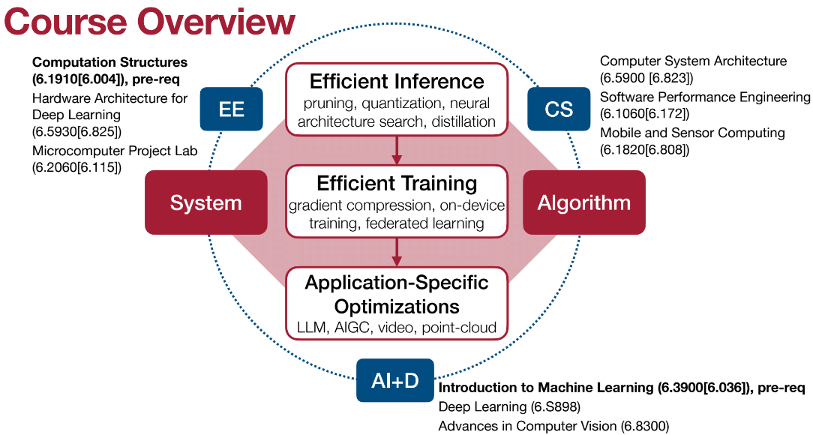
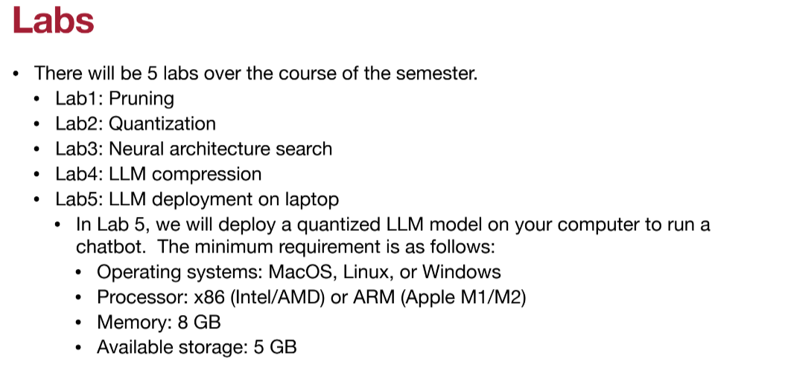
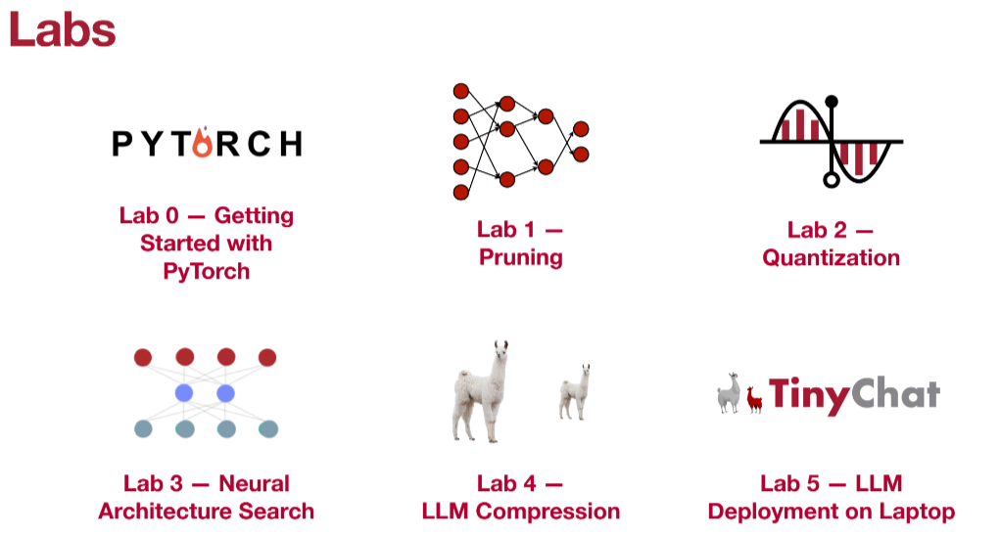
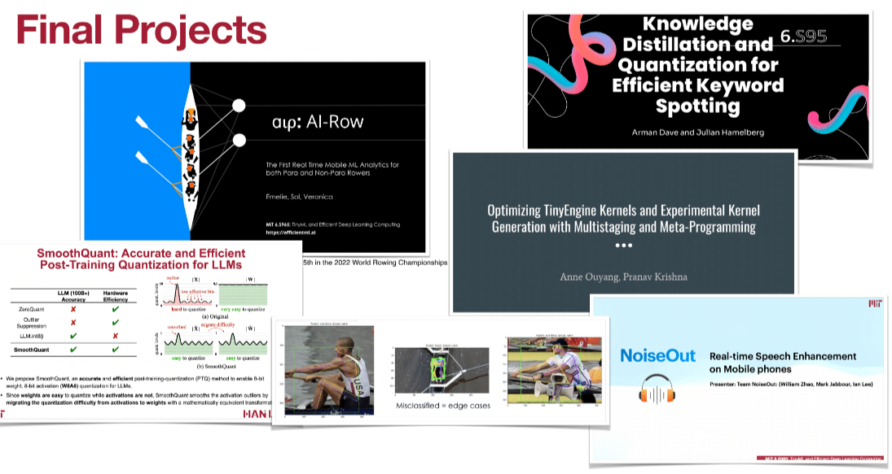
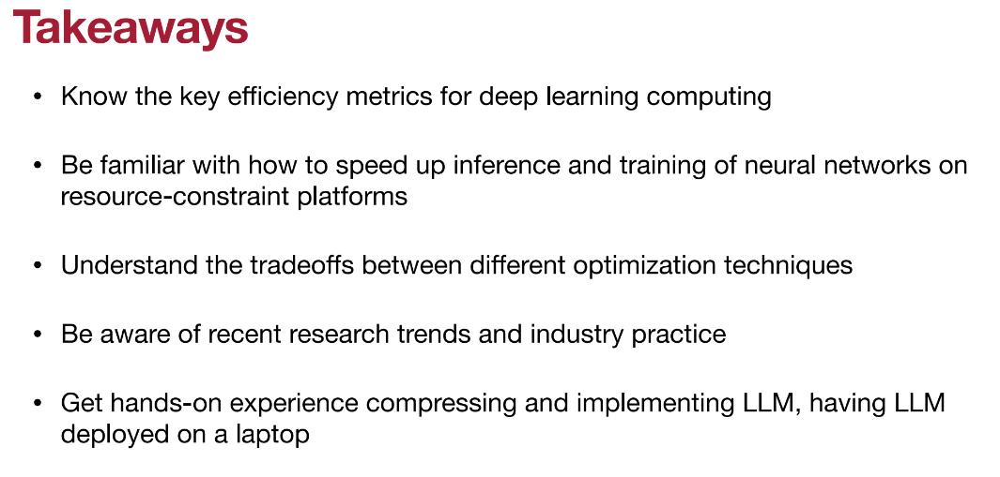

# TinyML-learning

Notes and lab exercises related to TinyML: Efficient Embedded/Edge AI inferencing

Course link: https://hanlab.mit.edu/courses/2024-fall-65940

Prerequisites:

- 6.191 Computation Structures
- 6.390 Intro to Machine Learning

